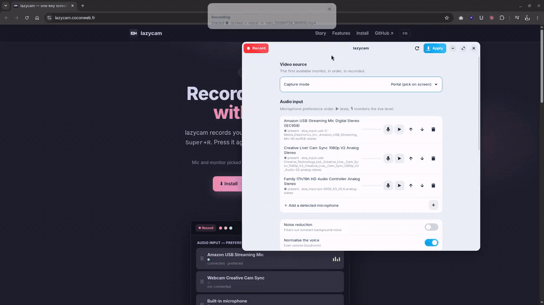

<div align="center">

# 🎥 lazycam

**One-key screen recorder for Ubuntu / GNOME on Wayland.**

*Press one key, it records your screen and your voice. Press it again, it's edited.*

A thin layer on top of [GPU Screen Recorder](https://git.dec05eba.com/gpu-screen-recorder/) (NVENC / VAAPI, very low CPU impact).

[](https://github.com/friteuseb/lazycam/releases)
[](https://github.com/friteuseb/lazycam/releases/latest)
[](LICENSE)

[Website](https://lazycam.coconweb.fr/) · 🇫🇷 [Version française](README.fr.md)

</div>

<!-- DEMO — uncomment once docs/demo.gif exists (see packaging/make-demo.sh)
<div align="center">



</div>
-->

---

## Requirements

| | |
|---|---|
| **Distribution** | Ubuntu / Debian (`.deb` package, `all` architecture) |
| **Desktop** | GNOME — the `Super+R` shortcut is registered through GNOME settings |
| **Session** | Built and tested on **Wayland**. Not tested on KDE, Xfce or X11. |
| **CPU** | amd64 · arm64 |

> lazycam is a **system integration tool**: it drives other programs and registers
> GNOME shortcuts. If you are on KDE or another desktop, the recording engine will
> work but the global shortcut will not be set up for you.

---

## Table of contents

- [Why lazycam?](#why-lazycam)
- [Install](#install)
- [Quick start](#quick-start)
- [Usage](#usage)
- [Configuration](#configuration)
  - [The graphical interface](#the-graphical-interface-lazycam-config)
  - [The `config.json` file](#the-configjson-file)
  - [How the mic and monitor are picked](#how-the-mic-and-monitor-are-picked)
- [How it works](#how-it-works)
- [Tutorial helpers](#tutorial-helpers)
- [Files & locations](#files--locations)
- [Troubleshooting](#troubleshooting)
- [Uninstall](#uninstall)
- [Development](#development)
- [License](#license)

---

## Why lazycam?

I just wanted to record my screen for tutorials. Surprisingly hard on Linux.
**OBS Studio** is a full production studio — brilliant for streaming, wild overkill
for pressing one button and recording three minutes; **the other tools** nearly all
make you open a window, aim and click; and **Bandicam** — whose "press a key, it
records" simplicity I loved — only exists on Windows. So I built the one I was
missing: Bandicam's simplicity, on Linux, actually working under Wayland.

Concretely, none of the good recorders (OBS, Kooha, GPU Screen Recorder…) do
*exactly* the right gesture for knocking out a quick tutorial:

- **One single key** to start **and** stop (`Super+R`). No window to aim at.
- **Mic picked automatically** by **preference order**: dedicated USB mic ›
  webcam › built-in mic. Plug in your good mic, it gets used, done.
- **Monitor picked automatically**: the GNOME portal by default (it remembers your
  choice), or by **monitor preference order** if you'd rather.
- **Pause / resume** (`Super+Shift+R`) without breaking audio sync.
- **Automatic edit** on stop: your voice is stitched back in and normalised into the MP4.

Clean output in `~/Videos/tuto_YYYYMMDD_HHMMSS.mp4`, ready to publish.

---

## Install

lazycam is a **system integration tool** (it drives other programs and registers
GNOME shortcuts), so it installs on the host rather than in a sandbox.

### Option A — APT repository *(recommended)*

Add the repository once, then `apt install`, and updates follow with `apt upgrade`:

```bash
sudo install -m 0755 -d /etc/apt/keyrings
curl -fsSL https://lazycam.coconweb.fr/apt/lazycam.gpg | sudo tee /etc/apt/keyrings/lazycam.gpg >/dev/null
echo "deb [arch=amd64,arm64 signed-by=/etc/apt/keyrings/lazycam.gpg] https://lazycam.coconweb.fr/apt stable main" | sudo tee /etc/apt/sources.list.d/lazycam.list >/dev/null
sudo apt update && sudo apt install lazycam
```

### Option B — direct `.deb` package

[Download the `.deb`](https://github.com/friteuseb/lazycam/releases/latest) then:

```bash
sudo apt install ./lazycam_0.1.0_all.deb
```

### After installing (Option A or B)

`apt` pulls every system dependency. Two steps remain **on the user side** (a
package runs as root and cannot do them for you):

```bash
flatpak install -y flathub com.dec05eba.gpu_screen_recorder   # 1) the capture engine
lazycam-shortcuts                                             # 2) enable Super+R
```

> **Why is `lazycam-shortcuts` separate?** Keyboard shortcuts live in
> **per-user** dconf. A package's `postinst` runs as root and therefore cannot
> write into *your* session. The `lazycam-shortcuts` command (or the **"Enable"**
> button in `lazycam-config`) registers them in your session.

### Option C — from source (git)

```bash
git clone https://github.com/friteuseb/lazycam.git
cd lazycam
./install.sh
```

`install.sh` is **idempotent** (safe to re-run) and does everything at once: checks
dependencies, offers to install the engine, copies the scripts into `~/.local/bin`,
installs the GUI, then registers the Super+R shortcuts **without touching** your
other GNOME shortcuts.

### Dependencies

| Tool | Ubuntu package | Role |
|------|----------------|------|
| GPU Screen Recorder | `flatpak` + Flathub | video capture engine |
| `pw-record`, `pw-dump` | `pipewire-bin` | audio capture & detection |
| `wpctl` | `wireplumber` | unmute the mic |
| `ffmpeg` | `ffmpeg` | editing / voice filters |
| `jq` | `jq` | reading the JSON config |
| `notify-send` | `libnotify-bin` | notifications |
| `gsettings`, `gdbus` | `libglib2.0-bin` | shortcuts & monitor detection |
| GTK 4 + libadwaita | `python3-gi gir1.2-gtk-4.0 gir1.2-adw-1` | graphical interface |

> The **gpu-screen-recorder** engine is not an apt package: it installs via Flatpak
> (command above). That's deliberate — it's the engine's official distribution.

---

## Quick start

```bash
lazycam-config        # open the settings, plug in your mic, check the level
```
Then, from anywhere:

- **`Super + R`** → recording starts (a "● Started" notification appears).
- Talk, show whatever you want.
- **`Super + R`** → stop: video and voice are edited together into an MP4.

---

## Usage

| Shortcut | Action |
|----------|--------|
| `Super + R` | Start / stop (then automatic edit) |
| `Super + Shift + R` | Pause / resume |

| Command | Role |
|---------|------|
| `lazycam-config` | graphical settings interface |
| `lazycam-shortcuts` | register / remove the shortcuts (`--remove`) |
| `gsr-config.sh` | **terminal** wizard: pick & test the mic |

---

## Configuration

All configuration lives in a single file: `~/.config/lazycam/config.json`. Edit it
through the graphical interface (recommended) or by hand.

### The graphical interface (`lazycam-config`)

A GTK4 / libadwaita window, launched by the `lazycam-config` command or from the
applications menu (**"lazycam"**). Top bar:

- **⏺ Record / ⏹ Stop** (left) — starts or stops the recording.
- **💾 Apply** (right) — **saves** the settings to `config.json`.

> ⚠️ Changes are only written when you click **Apply**.

Sections:

| Section | What you set |
|---------|--------------|
| **Video source** | Capture mode, and the monitor preference order (Monitor mode). |
| **Audio input** | Mic preference order (↑ ↓), test ▶ (4 s + playback), 🎙 live level, noise reduction, normalisation. |
| **Recording** | FPS, codec, quality, output folder. |
| **Tutorial helpers** | Show pressed keys (clicks: coming later). |
| **Keyboard shortcuts** | Enable / disable Super+R and Super+Shift+R. |

To reorder a list, use the **↑ ↓** arrows on each row. To remove an entry: 🗑. To
add a detected one: **＋**.

### The `config.json` file

```jsonc
{
  // Mic preference order: patterns (grep -iE) matched against the PipeWire name.
  // The first mic present that matches is used.
  "mic_order": ["Amazon_USB_Streaming_Mic", "Cam_Sync|Creative", "alsa_input\\.pci.*analog"],

  // Video capture mode: "portal" | "monitor" | "focused" | "region"
  "capture_mode": "portal",

  // Monitor preference order ("monitor" mode): patterns matched against the monitor name.
  "screen_order": ["DP", "HDMI", "eDP"],

  // Rectangle for "region" mode (widthxheight+X+Y). Empty otherwise.
  "region": "",

  "fps": 30,                 // 24 | 30 | 60
  "codec": "h264",           // h264 (compatible everywhere) | hevc | av1
  "quality": "very_high",    // medium | high | very_high | ultra
  "outdir": "~/Videos",      // output folder

  "denoise": false,          // noise reduction (highpass + afftdn)
  "normalize": true,         // volume normalisation (loudnorm)

  "show_keys": false,        // show pressed keys (showmethekey)
  "show_clicks": false       // (coming later: needs a GNOME extension)
}
```

**With no config file**, lazycam applies defaults identical to this table → a
"no surprises" behaviour, Portal mode.

#### Video capture modes

| Mode | Behaviour | Note |
|------|-----------|------|
| `portal` *(default)* | The GNOME portal asks which screen/window to share on first use, then **remembers** (one token per docked / undocked state). | The most reliable option on GNOME Wayland. |
| `monitor` | Records the **first monitor present** according to `screen_order` (direct `-w <name>` capture). | No pop-up. Picks the desk monitor by itself when docked. |
| `focused` | Records the **active window**. | |
| `region` | Records the `region` rectangle (`WxH+X+Y`). | Entered manually (mouse selection is not implemented yet). |

#### Voice filters

- `denoise: true` adds `highpass=f=90,afftdn=nf=-25` (cuts low rumble + spectral
  denoising).
- `normalize: true` adds `loudnorm=I=-16:TP=-1.5:LRA=11` (even volume, broadcast
  level). Both stack when enabled.

### How the mic and monitor are picked

This is the heart of lazycam. When a recording starts:

```
Mic:     for each pattern in mic_order (in order)
           → is there a PipeWire audio source whose name matches?
             yes → use that one, stop here.
         nothing matches → system default mic.

Monitor: "monitor" mode → for each pattern in screen_order (in order)
                            → does a connected monitor match? yes → record it.
         "portal" mode  → token remembered per docked / undocked state.
```

Patterns are **regular expressions** (`grep -iE`, case-insensitive) matched against
the mic's PipeWire `node.name` or the monitor name (`eDP-1`, `DP-2`…). For example
`Cam_Sync|Creative` catches the webcam whatever its exact label is;
`alsa_input\.pci.*analog` catches the internal analog input.

**What this means in practice**: you list your devices from most to least wanted,
and lazycam always takes the best one **available** right now. Unplug the USB mic →
it falls back to the webcam, then to the built-in one. Nothing to reconfigure.

---

## How it works

GPU Screen Recorder (Flatpak sandbox) captures **the screen only**: its PipeWire
sandbox only lets outputs through. So lazycam captures the **voice separately** and
stitches everything back together at edit time.

```
  Super+R (start)
        │
        ├─► gpu-screen-recorder  ──►  .rec_<stamp>.video.mp4   (screen, no audio)
        │
        └─► pw-record (mic)      ──►  .rec_<stamp>.mic.0.flac  (voice, segment 0)
                                       (pause → close the segment; resume → segment 1, 2…)

  Super+R (stop)
        │
        └─► ffmpeg: concat the audio segments  +  voice filters (denoise/loudnorm)
                    muxed with the video  ──►  ~/Videos/tuto_<stamp>.mp4
```

Why **audio segments**? Because `pw-record` cannot pause: on each pause we **close**
the current segment, on resume we **open** a new one. On stop, `ffmpeg` stitches them
back in order — the video handles its own pause through `SIGUSR2`. Both streams stay
in sync.

| Script | Role |
|--------|------|
| `gsr-toggle.sh` | start / stop + final edit |
| `gsr-pause.sh` | pause / resume (video via signal, audio via segments) |
| `gsr-common.sh` | shared settings & functions: config reading, mic choice (`pick_mic`), monitor choice (`video_capture_args`), state |
| `gsr-config.sh` | terminal wizard to pick & test the mic |
| `lazycam-shortcuts` | registers / removes the GNOME shortcuts (idempotent) |

---

## Tutorial helpers

- **Pressed keys**: enable *"Show pressed keys"* in `lazycam-config`. Requires
  [showmethekey](https://github.com/AlynxZhou/showmethekey), which lazycam starts
  when the recording starts and stops when you stop.

  ⚠️ **There is no Flathub or apt package for Ubuntu/Debian.** Upstream only ships
  packages for Arch, Fedora and openSUSE, so you have to build it:

  ```bash
  sudo apt install meson ninja-build gcc git libevdev-dev libinput-dev libudev-dev \
      libglib2.0-dev libgtk-4-dev libadwaita-1-dev libjson-glib-dev libcairo2-dev \
      libpango1.0-dev libxkbcommon-dev polkitd pkexec
  git clone https://github.com/AlynxZhou/showmethekey.git
  cd showmethekey && mkdir build && cd build
  meson setup --prefix=/usr . .. && meson compile && sudo meson install
  ```

  lazycam picks up the `showmethekey-gtk` binary automatically once it is on your
  `PATH`. Note that showmethekey reads `/dev/input` through a privileged helper, so
  it asks for authentication — do that once before you start recording, otherwise
  the polkit dialog lands in the middle of your video.

  For a one-off demo clip it is usually simpler to add the keypress in post:
  `packaging/make-demo.sh --key START:END` draws a "Super + R" badge over the video.
- **Click highlighting**: not available yet — under Wayland this needs a GNOME Shell
  extension, which isn't shipped for now.

> Under Wayland, global keyboard capture is deliberately locked down for security:
> that's why we delegate to a dedicated tool rather than implementing it ourselves.

---

## Files & locations

| Path | Contents |
|------|----------|
| `~/.config/lazycam/config.json` | your configuration |
| `~/.config/gsr-tokens/` | portal tokens (`portal` mode) |
| `~/Videos/tuto_*.mp4` | your recordings |
| `$XDG_RUNTIME_DIR/gsr-toggle.state` | state of the running recording |
| **Installed via `.deb`** | `/usr/bin/` (scripts), `/usr/share/lazycam/` (GUI) |
| **Installed via `install.sh`** | `~/.local/bin/` (scripts), `~/.local/share/lazycam/` (GUI) |

---

## Troubleshooting

| Symptom | Likely cause / fix |
|---------|--------------------|
| **No sound in the video** | Wrong mic picked, or muted mic. Open `lazycam-config`, test (▶) the mic you want, check its order. lazycam automatically unmutes the chosen mic. |
| **`Super+R` does nothing** | Shortcuts not registered. Run `lazycam-shortcuts` (or the "Enable" button in the GUI). Check that no other software grabs `Super+R`. |
| **The wrong mic is picked** | Reorder `mic_order` (the first one present wins). Plugged in too late? Click **"Re-detect"** in the GUI. |
| **Screen-share pop-up every time** | You're in `portal` mode and the token wasn't remembered, or you changed monitor. Make the choice once more, or switch to `monitor` mode. |
| **The GUI won't open** | GTK4/libadwaita missing: `sudo apt install python3-gi gir1.2-gtk-4.0 gir1.2-adw-1`. |
| **Duplicate shortcuts** | You ran `lazycam-shortcuts` from a folder other than the installed scripts. Run `lazycam-shortcuts --remove`, then re-run the **installed** copy. |

---

## Uninstall

- **`.deb` package**: `sudo apt remove lazycam`
- **From source**: `./uninstall.sh` (removes shortcuts, GUI and icon; asks about the
  scripts; **keeps** your config and your videos).

---

## Development

```
bin/        engine scripts (bash) + lazycam-shortcuts
gui/        lazycam-gui.py (GTK4) + lazycam_backend.py (pure, testable logic)
data/       icon + .desktop file
packaging/  build-deb.sh + update-apt-repo.sh
docs/       website (GitHub Pages, EN at /, FR at /fr/) + docs/apt/ (APT repository)
install.sh / uninstall.sh
```

`gui/lazycam_backend.py` does not import GTK: you can test it on its own (device
detection, config reading, mic test) with no graphical environment.

### Publishing a new release

```bash
# 1. build the package
./packaging/build-deb.sh 0.2.0           # → dist/lazycam_0.2.0_all.deb

# 2. regenerate + re-sign the APT repository
./packaging/update-apt-repo.sh           # → docs/apt/ (signed)

# 3. publish
git add docs/apt && git commit -m "release 0.2.0" && git push   # GitHub Pages serves the repo
gh release create v0.2.0 dist/lazycam_0.2.0_all.deb --title "lazycam v0.2.0"
```

> 🔑 **Repository signing key**: the private key lives in `~/.lazycam-apt-gnupg`
> (outside the git repository, **never committed**). **Back that folder up**: without
> it you can no longer sign an update, and users would have to import a new key. The
> distributed public key is `docs/apt/lazycam.gpg`.

---

## License

[GPL-3.0](LICENSE) — consistent with GPU Screen Recorder, the underlying engine.
Thanks to [dec05eba](https://git.dec05eba.com/gpu-screen-recorder/) for that engine.
